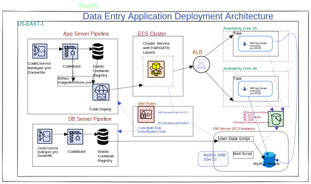

### [Deployment of PHP Data Entry Application Docker Containers in FARGATE/ECS](https://github.com/blue-hills/cloud-computing/tree/main/aws-ecs-fargate-containers)

* Use of ECS in Serverless FARGATE environment.
* Use of Load balancer to distribute the load across multiple Docker Containers.
* Implementation of MySQL and PHP Docker Containers for a Simple Data Entry Application
* Deployment of PHP Docker Container in ECS/FARGATE using Code Pipeline.
* Deployment of MySQL Docker Containers in EC2 instances

