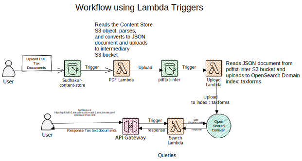

## Deployment of AWS Open Search Domain to search PDF documents using Lambdas
* Use of S3 Trigger Lambda functions to parse and upload the PDF Documents to the AWS Open Search Engine 
* Use of AWS Gateway REST API Lambdas to query the Open Search Engine
* Use of Boto3 Python library to create code pipelines and IAM roles 
* Use of SAM CloudFormation templates to deploy Lambdas using the AWS Code Pipelines

