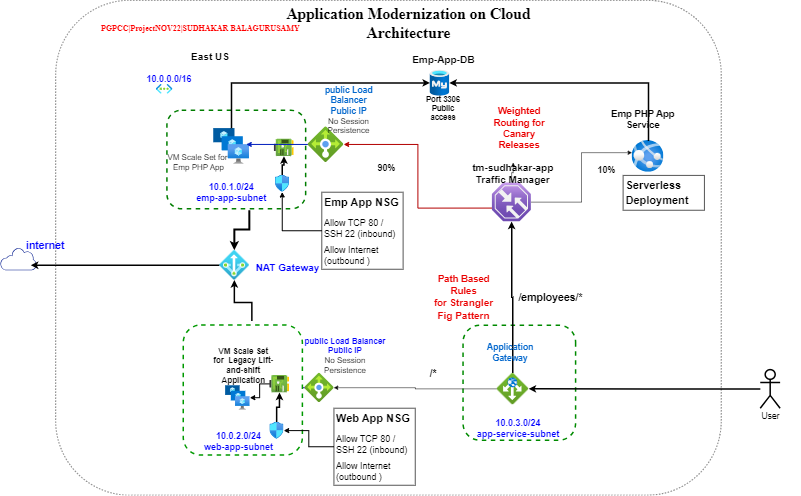

## [Deployment of Application Gateway, Traffic Manager, Load Balancers, VM Scale Sets, Flexible MySQL Sever database and App Service](https://github.com/blue-hills/cloud-computing/tree/main/az-appgw-tm-vmss-loadbal-appsvc)

### This project demonstrates the use of various Azure resources in implementing the following key software design patterns and ideas.

|   |   |
|---|---|
|Strangler Fig Pattern |Use of Application Gateway for gradual migration from legacy systems to modern systems based on Path based Rules|
|Canary Releases|Use of Traffic manager for canary releases based on weighted Routing method|
|Elasticity|VM scale sets to scale out/in based on loads/performance metrics|
|Load Balancer|Use of Public load balancer with Traffic Manager. Use of both Public & Private load balancer in Application Gateway. Session Affinity/persistence.|
|Serverless Deployment|Use of Git Hub workflow to deploy a PHP Web Application on App Service Plan.|
|Lift And Shift Cases|Use of VM Scale sets with appropriate OS and runtime binaries to run the legacy applications|

