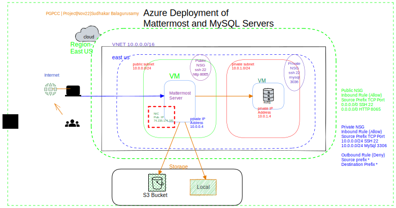

##   Deployment of MatterMost in Azure 
* Use of NSG rules and VNET to create public subnet to host the internet facing MatterMost servers
* Use of NIC and public IP address to access the MatterMost servers 
* Use of NSG rules and VNET to create private subnet to host MySQL servers and to deny the access from internet
* Use of AZ CLI to create VMS to run MatterMost and MySQL servers.
  